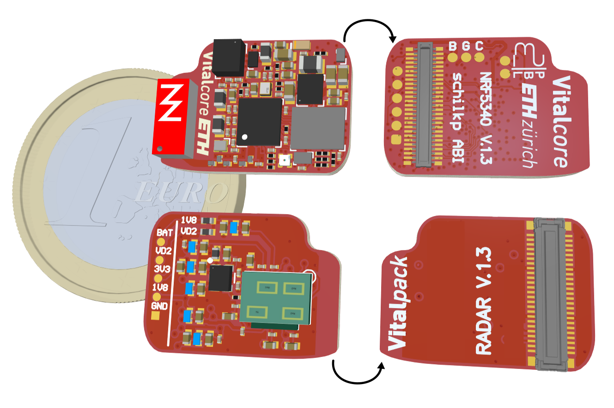

# VitalCore
Philipp Schilk, ETHZ D-ITET PBL
2022-2024

A Self-contained, Miniaturized, BLE-enabled Embedded Platform for Low-Power, Wearable, and Hearable Applications.

<p align="center">
  
</p>

<p float="center" align="center">
  
  
</p>
Pictures: Frank K. Gürkaynak, 2022

## Quick Links

 - 📄 [Full Documentation](./hardware/VC_NRF5340/Documentation/Complete_1.3/VC_NRF5340_FULL_DOC.PDF)
 - 🌍 [Interactive HTML BOM](./hardware/VC_NRF5340/Documentation/Complete_1.3/VC_NRF5340-Complete.html)
 - 📦 [Gerbers](./hardware/VC_NRF5340/Documentation/Complete_1.3/Manufacturing)
 - 📦 [PnP Files](./hardware/VC_NRF5340/Documentation/Complete_1.3/PickAndPlace)
 - ⚙️  [Altium Project](./hardware/VC_NRF5340/)

## Changelog
 - 03/04/2024: First public release (Hardware v1.3)

## Overview

### VitalCore:

The VitalCore is a highly integrated, miniaturized embedded systems platform that features everything
a low-power wearable project usually requires - except for application specific sensors
and transducers. Its small 17.6 mm ** 12.6 mm size allows it to be integrated even in the most constraint
applications, include in-ear/hearable projects. Based around an NRF5340 SoC, the VitalCore features
a dual-core Cortex-M33 processor running at up to 128 MHz, 1 MB of Flash, 512 KB RAM, and BLE 5.2
complete with an on-board chip antenna.

### VitalPack Interface & Connectors:

On its back, the VitalCore features a 0.4 mm pitch 50-position connector that can be used to attach
application-specific 'VitalPack' expansion boards. This connector exposes power inputs and outputs,
the SoC's programming interface and USB port, and 28 GPIO pins with ADC, I2C, SPI, I2S, UART, QSPI, and PDM
interfaces available. The SWD pin, battery and charger connections, and QVAR inputs are also available as SMD solder
pads on the back side.

The exact pinout is specified in the [full documentation pdf](./hardware/VC_NRF5340/Documentation/Complete_1.3/VC_NRF5340_FULL_DOC.PDF).

To accommodate different stacking heights, the following combinations of header (on the VitalCore) and receptacles (on
the VitalPack) can be used:

| **Stacking Height** | **Header**                           | **Receptacle**                       |
| ----------------- | ---------------------------------- | ---------------------------------- |
| 0.7mm             | JAE Electronics WP7B-P050VA1-R8000 | JAE Electronics WP7B-S050VA1-R8000 |
| 1.5mm             | Hirose DF40C-50DP-0.4V(51)         | Hirose DF40C-50DS-0.4V(51)         |
| 2.0mm             | Hirose DF40C-2.0-50DP-0.4V(51)     | Hirose DF40C-2.0-50DS-0.4V(51)     |
| 2.5mm             | Hirose DF40C-2.5-50DP-0.4V(51)     | Hirose DF40C-2.5-50DS-0.4V(51)     |

### Power:

A MAX77654 PMIC provides a full power subsystem, including a software-controlled battery charger with power path
switching and up to 300 mA charge current, a battery monitor, 3 software-controllable switch mode buck-boost converters each
with an output range of 0.8 V to 5.5 V, and two software-controlled LDOs each with an output range of 1.71 V to 5.3 V. All
on-board devices (SoC and peripherals) are powered using a dedicated 1.8 V buck converter, making all SMPS and LDO
outputs available application-specific circuitry via the VitalPack connector.


### Peripherals:

The VitalCore comes equipped with the following peripherals:

 - A high-performance LSM6DSV16BX IMU with accelerometer, gyroscope and QVAR frontend.
 - A 256Mb W25Q256JWYIM QSPI Flash.
 - An RGB LED and IS31FL3194 driver capable of LED animations/patterns.

### Panel:

The VitalCore Altium project/gerber files include a panel to be used during development.
It exposes the NRF's SWD programming interface, USB port, power inputs, and power rail test points. It
can be removed manually by cutting the small PCB bridges, or be excluded before production entirely.

## Hardware

> [!IMPORTANT]
> Device sheet folder must be configured correctly in Altium for project to be opened correctly.

This project uses device sheets to for common building blocks (in `VC_Common`) that
are used in other projects. The folder `VC_Common/DevSheets` must be added to Altium's
list of device sheet locations! See below:

https://www.altium.com/documentation/altium-designer/device-sheets

To avoid annotation collision between components in device sheets and components within each project,
all device sheet components are annotated with a 'D' Suffix.  Altium should be able to handle this via
'Board Level Annotation', but it has been rather buggy.

Any modifications to device sheets don't seem to propagate to projects using those sheets until those
projects are closed & re-opened, or Altium is restarted.

## Firmware Template

**Will follow shortly**

## VitalPack Template

**Will follow shortly**

## Gallery & Examples

Examples of VitalCore-based projects:

### [TinyssimoRadar](https://github.com/ETH-PBL/TinyssimoRadar):
In-Ear Hand Gesture Recognition with Ultra-Low Power mmWave Radars.

<p align="center">
  
</p>


### VitalPod:
[*A Low Power In-Ear Vital Parameter Monitoring System*](https://ieeexplore.ieee.org/abstract/document/9941646)

### In-Ear-Voice:
[*Towards Milli-Watt Audio Enhancement With Bone-Conduction Microphones for In-Ear Sensing Platforms*](https://dl.acm.org/doi/abs/10.1145/3576842.3582365)

## License and Attribution

Published under GNU GPLv3 license.

**Attribution information will follow shortly**


```
TODOs:
 - Radar paper attribution + link.
 - FW template.
 - Pack template.
```
